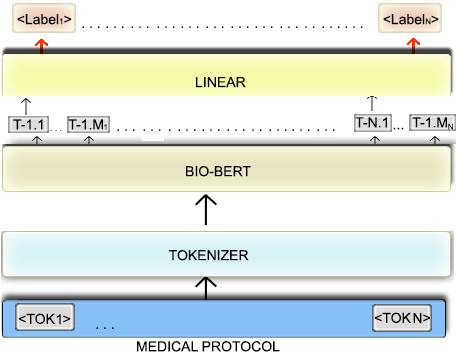

## Domain specific BERT representation for Named Entity Recognition of lab protocol
code for the system that secured 4 runner up at EMNLP 2020 workshop WNUT Shared Task-3

For more derail refer [shared task website](http://noisy-text.github.io/2020/wlp-task.html)

**code Credits**: [BERT_NER](https://github.com/weizhepei/BERT-NER)

## Dependencies and setup

- python 3.8 conda `create --name covid_entities python=3.8 & conda activate covid_entities`
- PyTorch 1.5.0, `cudatoolkit=10.1 conda install pytorch==1.5.0 cudatoolkit=10.1 -c pytorch`
- 🤗Huggingface transformers - 2.9.0 `pip install transformers==2.9.0`
- scikit-learn 0.23.1 pip install `scikit-learn==0.23.1`
- nltk pip 3.5 `install nltk==3.5`

## Model Description 

## Instruction for training the models
0. Set up the codebase and requirements
    -`git clone https://github.com/Ayushk4/extract_covid_entity & cd extract_covid_entity.`
    - Follow the instructions from the Dependencies and `set-up` above to install the dependencies.
1. Setup the dataset : Fllow instruction in `data/README.md`

2. Recreating the experiment for the final submission:
    -run `python train.py` --dataset=proto (BERT model will be automatically chosen (for now Bio-BERT). It will instantiate a model and train it on the training set following the hyper-parameters specified in `experiment/proto/params.json`. )
    - preprocessing of Dataset for bert input refer `data/readme`
We release the models weights for our final submission.

- **Bio-BERT model**[]

Model Performance on test set released for final evaluation using organisers [script](https://github.com/jeniyat/WNUT_2020_NER/tree/master/code/eval) (exact match)
**On exact matches**

| Entity          | Precision | Recall | F1    |
| --------------- | --------- | ------ | ----- |
| Action          | 87.85     | 85.2   | 86.5  |
| Amount          | 72.25     | 93.78  | 81.62 |
| Concentration   | 84.27     | 91.21  | 87.6  |
| Device          | 65.2      | 58.4   | 61.61 |
| Generic-Measure | 28.74     | 40.34  | 33.57 |
| Location        | 62.89     | 71.14  | 66.76 |
| Measure         | 66.73     | 51.3   | 58.0  |
| Mention         | 66.43     | 64.14  | 65.26 |
| Method          | 45.98     | 42.53  | 44.19 |
| Modifier        | 73.33     | 46.43  | 56.86 |
| Numerical       | 66.15     | 49.62  | 56.7  |
| Reagent         | 80.47     | 84.13  | 82.26 |
| Seal            | 72.45     | 59.66  | 65.44 |
| Size            | 54.93     | 16.39  | 25.24 |
| Speed           | 87.01     | 92.08  | 89.47 |
| Temperature     | 92.94     | 86.58  | 89.65 |
| Time            | 90.27     | 86.13  | 88.15 |
|pH               |   95.16   | 89.39  | 92.19 |

**On partial matches **

| Overall         | Precision | Recall | F1    |
| --------------- | --------- | ------ | ----- |
| partial matches | 81.76     | 77.43  | 79.54 |
| exact matches   | 77        | 72.93  | 74.91 |

## Coming Soon!

- Instructions for running our trained models on test set
- Details about our model architecture.
- Replicating our other experiments.

## License
MIT

